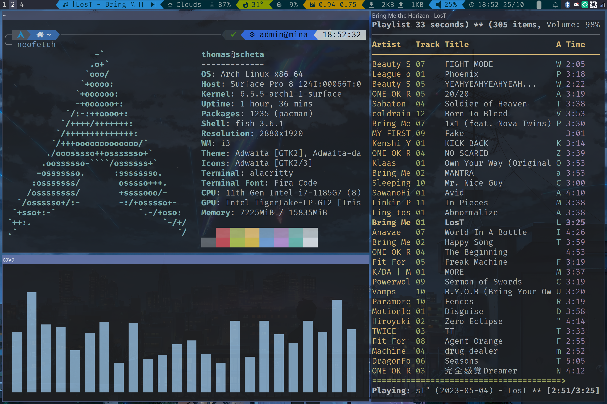

# Configuration files for my Arch/i3/X11 setup running on a Surface Pro 8

use `git config core.hooksPath hooks/` to enable hooks

use `git commit -m "message" --no-verify` to skip pre-commit hook

## Infos

- OS: [Arch](https://archlinux.org/)
- Kernel: [linux-surface](https://github.com/linux-surface/linux-surface)
- Window Manager: [i3](https://i3wm.org/)
- Display Server: [Xorg](https://www.x.org/wiki/)
- Login Manager: [ly](https://github.com/fairyglade/ly)
- Shell: [fish](https://github.com/fish-shell/fish-shell) with [tide](https://github.com/IlanCosman/tide)
- Terminal: [Alacritty](https://github.com/alacritty/alacritty)
- Bar: [i3status-rust](https://github.com/greshake/i3status-rust)
- Menu: [rofi](https://github.com/davatorium/rofi)
- Notifications: [dunst](https://github.com/dunst-project/dunst)
- Music: [mpd](https://github.com/MusicPlayerDaemon/MPD) with [ncmpcpp](https://github.com/ncmpcpp/ncmpcpp)

## Screenshots

